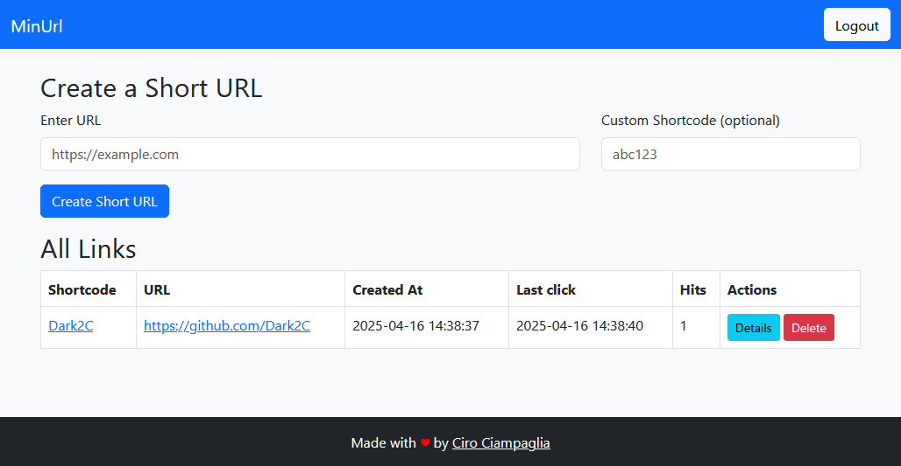

# MinURL

**MinURL** is a simple, self-contained PHP web app that lets you create and manage short URLs with basic click tracking, all from a single file.

## Main Features

- **One-file simplicity**: A single PHP file that can be uploaded to any web server with PHP support. Just drop it in, no external config files, no frameworks.
- **First-time guided setup**: On the first run, you'll be asked to:
  - Choose between SQLite or MySQL.
  - Enter your database credentials (for MySQL) or file path (for SQLite).
  - Set your admin password.
- **Shorten and redirect**: Generate short links for any URL. Users visiting a short link will be automatically redirected to the original.
- **Basic click tracking**: Each time a short link is visited, it logs:
  - IP address
  - Timestamp
  - User-Agent and other HTTP headers
- **Simple admin interface**: Log in to view and manage all shortened URLs. Clear and functional, with just what you need.
- **Database flexibility**: Choose between lightweight SQLite or more scalable MySQL, with support for table prefixing.

## How It Works

1. **Upload the file**: Upload `minurl.php` to any PHP-compatible web server.
2. **Initial setup**: On first access, follow the prompts to:
   - Choose your database type and connection details.
   - Set your admin password (it's hashed and saved directly into the file).
3. **Start shortening**: Once configured, use the web interface to create and manage your short URLs.

## File Structure

There's just one file, `minurl.php`. All logic, configuration, and UI are contained within it. This makes MinURL extremely portable and easy to back up, share, or drop into any project or internal toolset.

## When to Use MinURL

MinURL is ideal if you need:

- A private or internal URL shortener.
- Something you can set up in 2 minutes.
- A solution that doesn't require a complex stack or extra files.
- Basic click logging without needing full analytics dashboards.

It's especially useful for developers, teams, or anyone who wants a fast and reliable way to shorten links without giving data to third parties.

## MinURL vs YOURLS

If you're wondering how this compares to a project like [YOURLS](https://yourls.org), here's a quick breakdown:

| You want...                        | Go with... |
|------------------------------------|------------|
| Fast setup, minimal maintenance    | **MinURL** |
| Simplicity but real click tracking | **MinURL** |
| Full plugin ecosystem              | **YOURLS** |
| Rich analytics + REST API          | **YOURLS** |

## Screenshot

